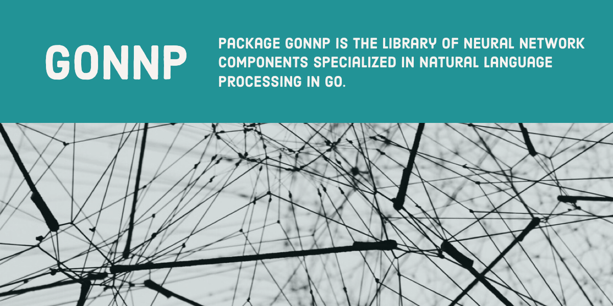

<p align="center">
  
  <h3 align="center">gonnp</h3>
  <p align="center">Deep learning from scratch using Go. Specializes in natural language processing</p>
</p>

---
 [](https://circleci.com/gh/po3rin/gonnp) <a href="https://codeclimate.com/github/po3rin/gonnp/maintainability"></a> [](https://golangci.com) [](https://goreportcard.com/report/github.com/po3rin/gonnp) [](https://codecov.io/gh/po3rin/gonnp) [](https://godoc.org/github.com/po3rin/gonnp)

## What

Package gonnp is the library of neural network components specialized in natural language processing in Go.　You can assemble a neural network with the necessary components.

## Dependencies

This component depends on ```gonum.org/v1/gonum/mat```
https://github.com/gonum/gonum/

## Components

The number of components will increase in the future.

### Layers

* Affine
* MatuMul
* Embedding
* EmbeddingDot
* Relu
* Sigmoid
* Softmax with Loss
* Sigmoid with Loss

### Optimizer

* SDG
* Adam

### Sampler

Unigram Sampler

## Directory

```
.
├── layers ---( Package layers impliments various layer for neural network. )
├── matutils ---( Package matutils has utility functions of gonum matrix. )
├── models ---( Package models has some of neural netwark models. )
├── optimizers ---( Package optimizers updates prams (ex. weight, bias ...) using various algorism. )
├── params ---( Package params has common parametors type. )
├── store ---( Package store lets you to store trained data. )
├── testdata
│   ├── ptb ---( Package ptb provides load PTB data functions. )
├── trainer ---( Package trainer impliments shorhand of training for deep lerning. )
└── word ---( Package word is functions of text processing. )
```

## Example

### Word2Vec

with EmbeddingDot Layers & Negative Sampling

```go
package e2e_test

import (
	"fmt"
	"io/ioutil"
	"log"
	"os"

	"github.com/po3rin/gonnp/matutils"
	"github.com/po3rin/gonnp/models"
	"github.com/po3rin/gonnp/optimizers"
	"github.com/po3rin/gonnp/trainer"
	"github.com/po3rin/gonnp/word"
)

func main() {
	windowSize := 5
	hiddenSize := 100
	batchSize := 100
	maxEpoch := 10

        // prepare one-hot matrix from text data.
	file, err := os.Open("../testdata/golang.txt")
	if err != nil {
		log.Fatal(err)
	}
	defer file.Close()
	text, err := ioutil.ReadAll(file)
	if err != nil {
		log.Fatal(err)
	}
	corpus, w2id, id2w := word.PreProcess(string(text))
	vocabSize := len(w2id)
	contexts, target := word.CreateContextsAndTarget(corpus, windowSize)

        // Inits model
        model := models.InitCBOW(vocabSize, hiddenSize, windowSize, corpus)
        // choses optimizer
        optimizer := optimizers.InitAdam(0.001, 0.9, 0.999)
        // inits trainer with model & optimizer.
        trainer := trainer.InitTrainer(model, optimizer)

        // training !!
        trainer.Fit(contexts, target, maxEpoch, batchSize)

        // checks outputs
	dist := trainer.GetWordDist()
	w2v := word.GetWord2VecFromDist(dist, id2w)
	for w, v := range w2v {
		fmt.Printf("=== %v ===\n", w)
		matutils.PrintMat(v)
	}
}
```

outputs

```bash
=== you ===
⎡ -0.983712641282964⎤
⎢ 0.9633828650811918⎥
⎢-0.7253396760955725⎥
⎢-0.9927919148802162⎥
    .
    .
    .
```

### MNIST

```go
package main

import (
        "github.com/po3rin/gomnist"
        "github.com/po3rin/gonnp/models"
        "github.com/po3rin/gonnp/optimizers"
        "github.com/po3rin/gonnp/trainer"
)

func main() {
        model := models.NewTwoLayerNet(784, 100, 10)
        optimizer := optimizers.InitSDG(0.01)
        trainer := trainer.InitTrainer(model, optimizer, trainer.EvalInterval(20))

        // load MNIST data using github.com/po3rin/gomnist package
        l := gomnist.NewLoader("./../testdata", gomnist.OneHotLabel(true), gomnist.Normalization(true))
        mnist, _ := l.Load()

        trainer.Fit(mnist.TestData, mnist.TestLabels, 10, 100)
}
```

## Reference

https://github.com/oreilly-japan/deep-learning-from-scratch-2

## TODO

* Impliments RNN
